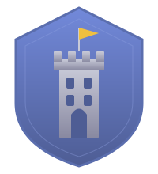

<p align="center">
  
</p>

<h1 align="center">GuildSpace</h1>
<p align="center"><strong>A place for guilds.</strong></p>

---

Your guild gets a home on the web. Not a chat server. A website.

A guild page with your roster, your history, your loot tables. Player pages with character profiles, raid attendance, DKP. A bulletin board, a bank ledger, a raid calendar. Real pages you can browse and link to.

Chat is here too. But chat is just one thing on the page, not the whole page.

**Ex Astra** is the first guild on the platform.

## Lineage

GuildSpace is being ported from a production Discord bot ([Project-1999-Typescript-Discord](https://github.com/ryandward/Project-1999-Typescript-Discord)) that manages an active EverQuest guild. Both the bot and the web platform share the same Railway Postgres database — real users, real data. We're building down from a working system, converting commands one at a time to run on the web.

## Architecture

```
┌──────────────────────────────────────────────────────────────┐
│  Client (React 19 + Vite 6 + Tailwind v4)                    │
│                                                              │
│  ┌─────────────┐ ┌─────────────┐ ┌────────────┐ ┌──────────┐ │
│  │ Roster Page │ │ Terminal    │ │ Login      │ │ Chat     │ │
│  └─────────────┘ └─────────────┘ └────────────┘ └──────────┘ │
└──────────────────────────────┬───────────────────────────────┘
                               │ Socket.IO + REST
┌──────────────────────────────┴───────────────────────────────┐
│  Server (Express + Socket.IO, TypeScript)                    │
│                                                              │
│  ┌─────────────────────────────────────────────────────────┐ │
│  │  Platform Shim (src/platform/shim.ts)                   │ │
│  │  Re-exports discord.js API surface so commands          │ │
│  │  run on both Discord and web without rewriting          │ │
│  └────────────────────────────┬────────────────────────────┘ │
│  ┌────────────────────────────┴────────────────────────────┐ │
│  │  Commands (src/commands_web/)                           │ │
│  │  census/ · dkp/ · utility/                              │ │
│  │  Auto-discovered at startup, no registration needed     │ │
│  └────────────────────────────┬────────────────────────────┘ │
│  ┌────────────────────────────┴────────────────────────────┐ │
│  │  TypeORM Entities → PostgreSQL (Railway)                │ │
│  └─────────────────────────────────────────────────────────┘ │
└──────────────────────────────────────────────────────────────┘
```

### Platform abstraction

Commands were originally written for discord.js. Instead of rewriting them, a **platform shim** (`src/platform/shim.ts`) re-exports platform-agnostic versions of discord.js classes — `SlashCommandBuilder`, `EmbedBuilder`, `ButtonBuilder`, etc. Commands import from the shim, not discord.js directly. Swap one import line and a Discord bot command runs on the web.

### Interaction flow

1. Client sends a WebSocket event (`executeCommand`)
2. Server creates a platform-agnostic `CommandInteraction`
3. Command handler calls `interaction.reply()` with embeds, buttons, modals
4. Socket.IO sends the response back to the client
5. React frontend renders the result

## Stack

| Layer | Technology |
|-------|-----------|
| Frontend | React 19, Vite 6, Tailwind CSS v4, CVA recipes |
| Backend | Express, Socket.IO, TypeScript (ESM) |
| Database | PostgreSQL via TypeORM |
| Auth | Discord OAuth2 → HMAC tokens |
| Hosting | Railway |
| Fonts | Syne (display), Nunito Sans (body), JetBrains Mono (code) |

## Project structure

```
├── client/                     # React frontend
│   └── src/
│       ├── components/         # App components (roster, chat, commands)
│       ├── ui/                 # Design system (Button, Card, Input, Text, Badge)
│       ├── pages/              # LoginPage, SetupPage, RosterPage
│       ├── layouts/            # AppShell (header + terminal)
│       ├── context/            # AuthContext, SocketContext
│       ├── utils/              # Animation helpers (stagger, phase)
│       └── index.css           # Design tokens (@theme axioms)
├── src/                        # Express backend
│   ├── platform/
│   │   ├── shim.ts             # discord.js compatibility layer
│   │   ├── types.ts            # Platform-agnostic interfaces
│   │   └── web/server.ts       # Express + Socket.IO server
│   ├── commands_web/           # Ported web commands
│   │   ├── census/             # main, alt, bot, claim, change, ding, drop, toons, whois
│   │   ├── dkp/                # dkp, attendance
│   │   └── utility/            # ping
│   ├── commands/               # Shared business logic (used by Discord bot too)
│   ├── entities/               # TypeORM entities (Census, Dkp, Attendance, Bank, etc.)
│   └── migrations/             # SQL migrations (001_, 002_, ...)
├── CLAUDE.md                   # Development guidelines
└── DESIGN.md                   # Design system principles
```

## Commands

The Discord bot has 30 commands. 12 have been ported to GuildSpace.

### Ported

| Category | Commands |
|----------|----------|
| **Census** (9) | `main` `alt` `bot` `claim` `change` `ding` `drop` `toons` `whois` |
| **DKP** (2) | `dkp` `attendance` |
| **Utility** (1) | `ping` |

### Not yet ported

| Category | Commands | Notes |
|----------|----------|-------|
| **Census** (3) | `assign` `reassign` `promote` | Officer-gated, needs guild role system |
| **Bank** (4) | `expense` `income` `plat` `find` | Bank management, needs component collectors |
| **Utility** (11) | `account` `add` `remove` `browse` `create_role` `roles` `delete_shared_toon` `help` `listaccounts` `login` `note` | Mixed — some Discord-specific, some need rethinking for web |

## Data model

The database stores everything an EverQuest guild needs to operate:

- **Census** — character registry (name, class, level, status: Main/Alt/Bot/Dropped)
- **DKP** — Dragon Kill Points ledger (earned vs. spent per player)
- **Attendance** — raid attendance records (character + raid event)
- **Items** — loot award history (who won what, for how much DKP)
- **Bank** — guild bank inventory (banker, location, item, quantity)
- **Raids** — raid definitions and DKP modifiers
- **GuildSpaceUser** — Discord identity → display name mapping
- **ChatMessage** — real-time chat messages

## Design system

The frontend design system is mathematically derived from a small set of axioms. Every value traces to a named constant, perceptual threshold, or mathematical derivation — nothing is arbitrary.

**Axioms** (defined in `client/src/index.css`):

| Token | Value | Basis |
|-------|-------|-------|
| `--base-size` | `1rem` (16px) | Browser default, WCAG SC 1.4.4 |
| `--type-ratio` | `1.25` | Major third (modular scale) |
| `--space-unit` | `0.5rem` (8px) | Universal grid constant (Material, Carbon, Ant) |
| `--phi` | `1.618034` | Golden ratio — timing, stagger, animation |
| `--lum-bg` | `0.14` | OKLCH base lightness (dark, not crushed) |
| `--lum-step` | `0.035` | Perceptual elevation increment (Weber fraction) |
| `--surface-hue` | `55` | Warm amber direction in OKLCH |
| `--accent-hue` | `85` | Warm gold accent |

**Derived systems**:
- **Type scale**: `base × ratio^n` — nano through hero, 8 stops
- **Spacing**: multiples of 8px grid
- **Color surfaces**: OKLCH with perceptually uniform elevation steps
- **Timing**: φ-scaled durations (76ms → 524ms), never integer-related
- **Opacity**: Weber-Fechner geometric scale (equal perceptual steps)
- **Border radius**: derived from `--space-unit`

Change one axiom, everything downstream recalculates. See [DESIGN.md](DESIGN.md) for the full derivation with citations.

## Development

### Prerequisites

- Node.js
- PostgreSQL (or Railway database credentials)
- Discord application (for OAuth)

### Environment

Copy `.env.example` to `.env` and fill in your credentials:

```
PGHOST=...
PGPORT=...
PGUSER=...
PGPASSWORD=...
POSTGRES_DB=...
PORT=3000
DISCORD_CLIENT_ID=...
DISCORD_CLIENT_SECRET=...
DISCORD_REDIRECT_URI=...
```

### Build and run

```bash
npm run build    # Compiles client/ (Vite) and src/ (tsc) → dist/
npm start        # node dist/index_web.js
```

For frontend development with hot reload:

```bash
cd client && npm run dev    # Vite dev server on :5173, proxies to :3000
```

### Porting a command from the Discord bot

1. Copy the command file from the Discord bot into `src/commands_web/<category>/`
2. Change the import from `'discord.js'` to `'../../platform/shim.js'`
3. Fix any Discord-specific APIs not yet in the shim (or extend the shim)
4. Commands are auto-discovered — no registration step needed

## License

ISC
