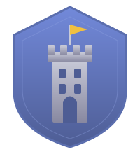

<p align="center">
  
</p>

<h1 align="center">GuildSpace</h1>
<p align="center"><strong>A highly scalable functorial state engine for Project 1999</strong></p>

> **About the author**
> I am a database architect with about 20 years experience and a PhD in Bacteriological Genetics. By day I am the solo engineer at a genomics startup pushing 4000+ commits a every six mopnnths, building data GUIs to help you DNA. By night GuildSpace is my sandbox. It is a production grade guild management ecosystem built to prove I write fast scalable code. Whether I am running anomaly detection on a genetic alignment or architecting a multi tenant state machine for a 25 year old MMO the math doesnt change.

***

[GuildSpace](https://guildspace.org/) completely replaces your dusty spreadsheets and fragmented Discord channels with a unified system of record. Real time rosters character state tracking raid attendance ledgers DKP tracking guild bank inventory and integrated WebSocket chat. 

Ex Astra is the first guild on the platform and they hammer it daily so visit the live site at [guildspace.org](https://guildspace.org/).

## Roadmap: The Universal State Engine

GuildSpace is currently migrating from a standard relational model to a strictly normalized multi model projection engine. We are handling topological mapping high dimensional vector search and functorial multi tenancy. 

The frontend UI is irrelevant. It is simply a mathematically derived projection layer that syncs with the backend via raw WebSockets while Postgres acts as the universal state engine. It is heavily augmented with Apache AGE for graph topology pgvector for high dimensional embeddings and TimescaleDB for telemetry.

### Telemetry & state flow

```text
  [ Raw Combat Telemetry ] -------+
  [ Distributed Ledger Dumps ] ---+--> [ Ingestion Pipeline & State Parser ]
  [ Discord Auth/Presence ] ------+                 |
                                                    V
 +---------------------- THE UNIVERSAL STATE ENGINE (PostgreSQL) ----------------------+
 |                                                                                     |
 | +------------------------+  +------------------------+  +-------------------------+ |
 | |    Temporal Engine     |  |   Topological Engine   |  |   Vector Index (ANN)    | |
 | |     (TimescaleDB)      |  |      (Apache AGE)      |  |       (pgvector)        | |
 | |                        |  |                        |  |                         | |
 | |  Hyper-tables storing  |  |   User-defined triple  |  |   High-dim embeddings   | |
 | |  microsecond combat    |  |   store unbounded      |  |   of optimal builds     | |
 | |  events raid wipes     |  |   graphs mapping all   |  |                         | |
 | |  detected as time-     |  |   state morphisms      |  |   Input: target gear    | |
 | |  series anomalies      |  |                        |  |   Output: DKP bid path  | |
 | +-----------+------------+  +-----------+------------+  +------------+------------+ |
 |             |                           |                            |              |
 | +-----------V---------------------------V----------------------------V------------+ |
 | |                   Functorial Multi-Tenant Ruleset Mapper                        | |
 | |                                                                                 | |
 | |   Game state transitions are morphisms multi-tenancy is modeled as functors     | |
 | |   mapping categories of rulesets to isolated database schemas natively          | |
 | +---------------------------------------+-----------------------------------------+ |
 +-----------------------------------------+-------------------------------------------+
                                           |
 +-----------------------------------------V-------------------------------------------+
 |                                Client Projections                                   |
 |                [ Mathematically Derived UI ]  <-->  [ Socket.IO ]                   |
 +-------------------------------------------------------------------------------------+
```

### 1. Dynamic topology & functorial multi tenancy
Standard multi tenancy relies on rigid schemas. The Universal State Engine abandons this for an unbounded user defined triple store backed by graph theory. Cities alliances guilds and equipment are objects and the relationships between them are created entirely by the users as morphisms. State is mapped categorically. 

If Domain A networks via `friend` and Domain B networks via `buddy` the mapping is a functorial operation $F(\text{friend}) = \text{buddy}$ resolving them as structural synonyms. It scales infinitely without DDL migrations.

### 2. Graph hopping and more_like_this
Here is where the architecture gets interesting. Standard queries are dead so we define a functor $F: \mathcal{C} \to \mathbf{Met}$ mapping the category of game states to a metric space of vector embeddings. The distance metric is defined by the infimum of path integrals along the graph edges combined with the ANN vector distance:

$$d_F(x, y) = \inf_{\gamma} \int_0^1 \left\| \frac{d}{dt} F(\gamma(t)) \right\| dt + \lambda \langle \mathbf{v}_x, \mathbf{v}_y \rangle$$

So what does this actually mean. It means we are graph hopping to show more_like_this using approximate similarities because every player and item is a node. 

> PING! Oh shit! Sethous the level 60 Rogue just got a [Mrylokars Dagger of Vengeance](https://wiki.project1999.com/Mrylokar%60s_Dagger_of_Vengeance).

You know this because you graph hopped. See, you are a level 60 Rogue too with similar raiding habits so the system traverses the bipartite graph of player item interactions and calculates the cosine similarity of your temporal attendance vectors weighted by the cohomology group of the equipment sub graph:

$$\text{sim}(R_{you}, R_{Sethous}) = \frac{\sum_{t \in T} w_t \cdot \mathbb{I}(raid_{you, t}) \mathbb{I}(raid_{Sethous, t})}{\sqrt{\sum w_t \mathbb{I}_{you}^2} \sqrt{\sum w_t \mathbb{I}_{Sethous}^2}} \otimes \mathcal{H}^1(E)$$

When Sethous equips the dagger the state engine recalculates the state delta and outputs a push notification telling you exactly how much DKP you need to bid on the next dagger. The nearest neighbor algorithm proves your DPS delta will bridge the gap on the next Nagafen kill so it literally tells you what to shoot for.

### 3. Combat telemetry as time series anomalies
Ingesting raw distributed combat log streams from 72+ concurrent raiders into Postgres time series hyper tables. By running window functions over microsecond level combat events we treat a raid exactly like a distributed system. We detect points of failure missed spell weaves and raid wipes using the exact same mathematical models I use to detect genetic anomalies in DNA sequence alignments.

## Mathematically derived UI
The roster page provides a complete view of the guild census via a squarified treemap showing class composition. It natively filters the data table below on interaction. The frontend design entirely avoids third party component bloat relying instead on a mathematically derived design system mapped strictly to CSS variables. Check DESIGN.md for the math.

## Execution
Ensure you have Node.js Postgres and a Discord OAuth application provisioned. 

```bash
cp .env.example .env
npm run build    
npm start        
```

For local client projection iterations just `cd client && npm run dev`. If you cant figure that out you probably should not be cloning this repo.
